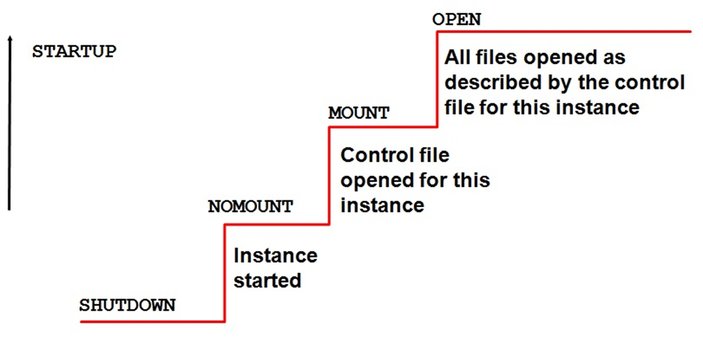

**1.  Что такое словарь данных Oracle? Для чего он необходим?**

Словарь Oracle - набор таблиц и связанных с ними представлений, который представляет возможность отследить внутреннюю структуру  базы данных и деятельность СУБД Oracle

**2.  Проклассифицируйте представления словаря данных Oracle.**

-	USER	Объекты, принадлежащие пользователю
-	ALL	Объекты, к которым пользователь имеет доступ
-	DBA	Все объекты базы данных (для администратора БД)
-	V$	 Производительность сервера

**3.  Что значит Oracle 12c имеет клиент-серверную архитектуру?**

Это означает, что СУБД и базы данных размещены на одном сервере, к которому обращаются с запросами разные пользователи. Получить доступ к данным через этот сервер можно с любого компьютера или специального ПО.

**4.  Что такое экземпляр (инстанс) сервера СУБД?**

Экземпляр (инстанс) сервера СУБД представляет собой копию исполняемого файла, который работает как служба операционной системы. Каждый экземпляр управляет несколькими системными базами данных и одной или несколькими пользовательскими базами данных.

**5.  Перечислите все этапы старта и останова инстанса Oracle 12c. Поясните их назначение.**

unmount, shutdown

**6.  Где указывается, что при старте операционной системы будет запущен инстанс Oracle 12c?**

ORADIM -EDIT -SID {your_SID} -STARTMODE AUTO -SRVCSTART SYSTEM

**7.  Поясните назначение опции Oracle 12c Multitenant.**

- Oracle Multitenant - технология, позволяющая запустить несколько независимых баз данных в рамках одного экземпляра. 
- Каждая база данных имеет свой набор табличных пространств и набор схем, но при этом у них общая SGA и один набор серверных процессов.  
- Базы данных изолированы, друг о друге ничего не знают, не конфликтуют между собой.
- Словарь разбивается на две части: общую часть и локальную.

**8.  Поясните назначение баз данных CDB, PDB, PDB$SEED.**

- CDB - container DB – контейнер базы данных
- PDB - pluggable DB –  подключаемые базы данных
- PDB\$SEED - это системный шаблон, который CDB использует для создания новых PDB. Вы не можете добавлять или изменять объекты в PDB\$SEED.

**9.  Что такое общий пользователь Oracle 12c Multitenant?**

пользователь, доступный в нескольких PDB. Наверное

**10. Какие табличные пространства автоматически создаются при инсталляции СУБД Oracle 12c?**

system, sysaux, temp, undotbs1, users, example

**11. Какие 2 пользователя обязательно создаются при инсталляции СУБД Oracle 12c?**

system, sys

**12. Какие табличные пространства дублируются в каждой PDB?**

temp. Мб ещё

**13. Что такое консолидация баз данных? В каких случаях прибегают к консолидации баз данных?**

Сбор данных из разных источников в одно хранилище

**14. Какие преимущества дает Oracle 12c Multitenant?**

- Можно создавать несколько CDB – для разных версий программного обеспечения СУБД.
- Одну и ту же PDB можно переносить между CDB.