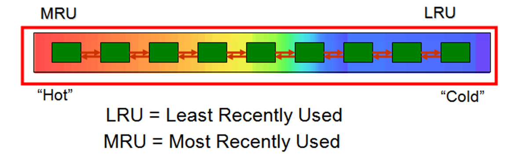
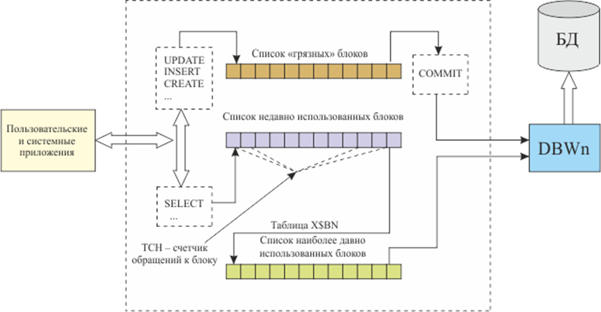
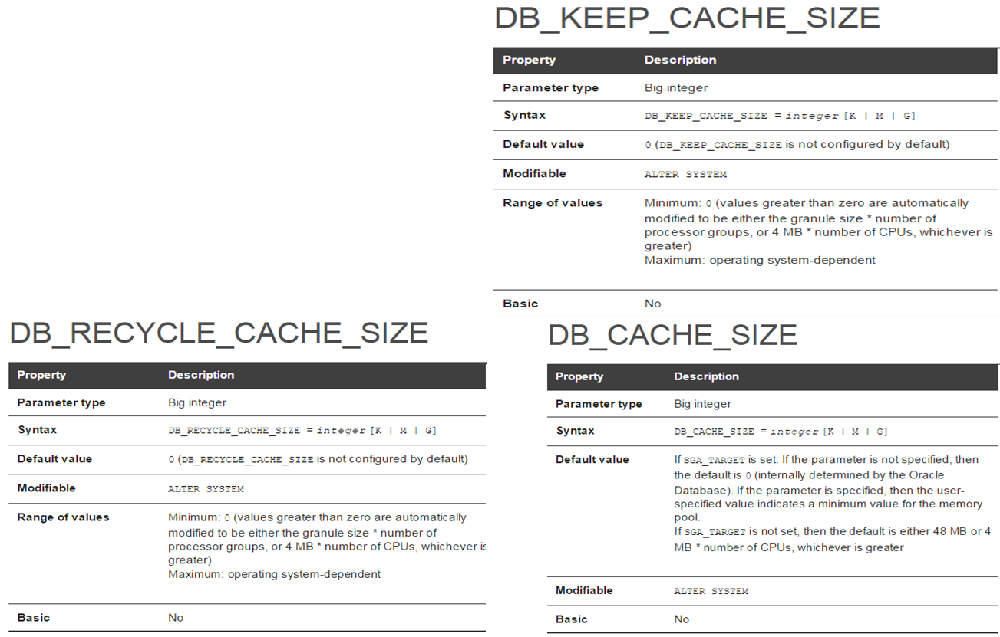

1.	Расшифруйте аббревиатуру SGA. 

- При запуске экземпляра выделяется область разделяемой памяти, называемая SGA
- Системная Глобальная область - SGA
- группа областей разделяемой памяти
- содержат данные и управляющую информацию для одного экземпляра Oracle
- совместно используется всеми серверными и фоновыми процессами

2.	Перечислите основные пулы памяти SGA, поясните их назначение.

- **Буферный** пул 
  - содержит образы блоков, считанные из файлов данных или созданные динамически, чтобы реализовать модель согласованного чтения
  - Совместно используется всеми пользователями
  - хранит блоки данных табличных пространств
- **Java** pool
  - предназначен для работы Java-машины
- **Large** pool (большой)
  - Большой пул  - область памяти SGA, применяемая для хранения больших фрагментов памяти
  - В этой области не применяется вытеснение по алгоритму LRU
  - память становится свободной сразу после того, как перестает использоваться
  - аналог RECYCLE (разделяемый пул – KEEP)
  - хранятся данные при резервном копировании (RMAN), специальные области UGA и пр.
- **Shared** pool (разделяемый)
  - Библиотечный кэш
  - Разделяемую область SQL
  - Кэш словаря данных
  - Управляющие структуры
- **Streams** pool 
- **“Null”** pool

3.	Поясните параметры SGA_MAX_SIZE и SGA_TARGET.

- **SGA_MAX_SIZE** определяет максимальный размер SGA на протяжении жизни экземпляра. 
- **SGA_TARGET** указывает текущий (возможный) размер памяти

4.	Поясните назначение буферного кэша инстанса. 

содержит образы блоков, считанные из файлов данных или созданные динамически, чтобы реализовать модель согласованного чтения (то же самое, что **буферный пул**)

5.	Поясните назначение пулов КЕЕP, DEFAULT и RECYCLE буферного кэша. 

- **KEEP**: Хранит блоки, которые часто используются, чтобы избежать их вытеснения.
- **DEFAULT**: Хранит блоки, которые не относятся к другим пулам.
- **RECYCLE**: Хранит блоки, которые редко используются и могут быть вытеснены1.

6.	Поясните принцип вытеснения блоков буферного кэша (LRU).

  
Алгоритм LRU (least recently used)– первыми вытесняются блоки с наименьшим значением счетчика  
Запись грязных блоков на диск осуществляется в 4х случаях:
  1) истечение тайм-аута (3 сек);                
  2) контрольная точка; 
  3) превышение длины грязных блоков заданного лимита;
  4) процесс не может обнаружить свободный блок.

7.	Поясните принцип вытеснения блоков таблицы, созданной оператором  CREATE TABLE … CACHE.
CACHE – помещение таблицы в конец LRU-списка (для малых таблиц) обычно в default pool.  
При использовании опции CACHE при создании таблицы в Oracle, блоки этой таблицы будут храниться в буферном кэше даже после прочтения с диска. Это позволяет ускорить доступ к этим данным при последующих запросах.

8.	Как изменить размеры пулов?

- Устанавливаются alter system set …
- В файле параметров

9.	Какие пулы допускают изменение размеров?

- default
- keep
- recycle

10.	Поясните назначение процесса LISTENER.

- Listener – это программа-сервер, прослушивающая TCP-порт, принимающая запросы на соединение с Oracle экземпляром от программ-клиентов. 
- В результате успешной работы Listener устанавливается соединение между программой-клиентом и обработчиком запросов экземпляра

11.	Поясните назначение утилиты lsnrctl.

утилита управления процессом Listener
можно его останавливать, запускать, смотреть статус, какие сервисы им обслуживаются и т.д.

12.	Что такое сервис? 

Точки подключения называются сервисами и имеют символические имена

13.	Какие сервисы создаются автоматически при инсталляции инстанса?

- SYS$USERS (по умолчанию, указывается SID в параметрах соединения), 
- сервис с именем инстанса (указывается  сервис)

14.	Поясните принцип работы dedicated-соединения и shared-соединения. 

- При использовании dedicated-соединения каждому клиентскому процессу выделяется отдельный серверный процесс
- Shared
  - Уменьшается количество серверных процессов
  - Предпочтительнее, когда в системе присутствует большое количество пользователей

15.	Поясните назначение файла LISTENER.ORA.

Этот файл содержит конфигурацию службы, прослушивающей входящие подключения к базе данных. В нем определяются параметры, такие как порт, протоколы и адреса, на которых листенер ожидает подключений.

16.	Перечислите основные фоновые процессы, перечислите их назначение.

- LREG (Listener Registration Process – периодическая регистрация сервисов в процессе Listener )
- DBWh (фоновый процесс записывающий по LRU измененные блоки (грязные блоки) в файлы базы данных)
  - В большинстве случаев достаточно одного процесса
  - Если процессор 1, то в более чем в 1 DBW  не смысла 
  - Проверяет с периодичностью не менее 3 сек. наличие измененных блоков и инициирует checkpoint  и по команде фонового процесса CKPT сбрасывает некоторую их часть на диск
  - Использует асинхронный ввод-вывод для записи блоков на диск
  - DBW записывает измененные (LRU, RECYCLE/DEFAULT/KEEP) блоки на диск и освобождает место в буферном кэше
- CKPT
  - CKPT выполняет процесс checkpoint
  - Выполняется при shutdown, alter system checkpoint, переключении REDO – журнала, периодическом сообщение от DWR, backup
  - записывает информацию о контрольной точке в управляющие файлы
  - дает команду DBW на сброс буферов
  - дает команду LGWR на сброс буферов
  - инициирует создание контрольной точки 
  - изменяет управляющие файлы (последний SCN)
  - изменяет заголовки файлов
  - сигнализирует DBWR о необходимости сбросить буферы
- LGWR
  - Log Writer Process – только один
  - управляет буфером журналов повтора
  - записывает блоки буфера журналов повтора в группы журналов
  - записывает изменения  базы данных до их фиксации DBWR в базе данных
  - переключает текущую группу
    - Раз в 3 секунды
    - При фиксации транзакции
    - При заполнении буфера на 1/3 или записи в него 1Мб
  - Если по какой-то причине LGWR не может записать данные в один из файлов группы, он продолжает работать (информация об этом событии в alert)
  - Если файл в группе один или  нет возможности записать ни в один файл группы, то экземпляр остановится
  - Производительность LGWR является критической для экземпляра
  - Инициирует создание контрольных точек 
  - Чем чаще контрольные точки, тем меньше времени потребуется при восстановлении базы данных при сбое
- PMON
  - Process monitor – отвечает за очистку после ненормального закрытия подключений
  - Инициирует откат незафиксированных транзакций, снятие блокировок, и освобождение ресурсов SGA
  - следит за работой других фоновых процессов, отвечает за их перезапуск
  - восстанавливает работу dispatcher или shadow процессов при системном сбое
- SMON
  - System Monitor Process – системный монитор
  - Восстановление экземпляра для узла
  - Восстановление незавершенных транзакций
  - Очистка временных сегментов данных
  - Очистка временных табличных пространств
  - Объединение свободного пространства
  - Очистка таблицы OBJ
  - Сжатие сегментов отката
- RECO
  - Recovery Process – разрешение проблем связанных  с распределенными транзакциями
  - Одна из баз данных, к которой первоначально подключился клиент, становится координатором
  - Сервер опрашивает остальные N -1 серверов, готовы ли они фиксировать транзакцию
  - Каждый из N -1 серверов сообщает о своем состоянии готовности как да (YES) или нет (NO)
  - Если любой из серверов вернул NO, вся транзакция откатывается
  - Если все серверы вернули YES, координатор рассылает всем N - 1 серверам сообщение о постоянной фиксации
- ARCn
  - Archiver Process – копирует файлы журнала повтора после переключения группы журналов
  - Необязательный процесс
- Flashback Data Archiever
  - архивирование ретроспективных данных

17.	Что такое серверный процесс? Как просмотреть серверные процессы?  
Серверный процесс:
- Получает и выполняет SQL-операторы
- Читает файлы данных
- Осуществляет поиск в кеше  
Процесс, который обслуживает индивидуальный пользовательский процесс. Каждый пользователь, подключенный к базе данных, имеет свой отдельный серверный процесс.  
SELECT * FROM V$PROCESS;